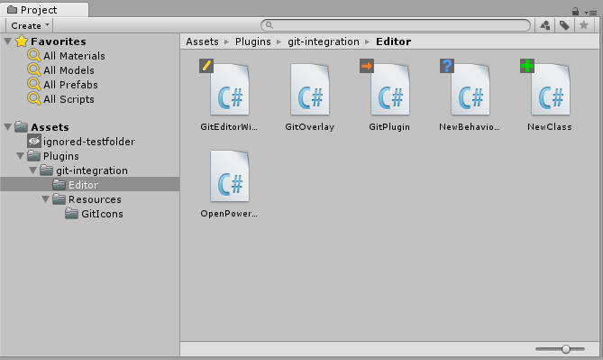
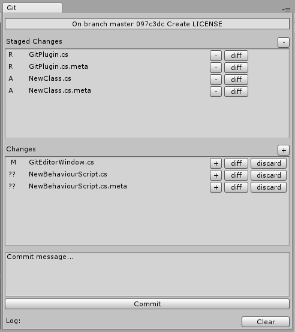

# unity-git-integration 
Git Client Plugin for Unity3D

## Installation
Simply check out the repository and copy the [Assets/Plugins/git-integration](Assets/Plugins/git-integration) folder to your project.
Maybe I'll add a build as .unitypackage later.

## Features
The central feature of the plugin is an overlay for the project view:

There is also an editor window to stage files and submit commits:

The plugin is configured via the usual `$HOME/.gitconfig`, so in order to use the plugin,
your git installation has to be properly set up.

### Overlay Icons
|Icon|File Status|
|-|-|
||added (_only staged changes_)|
||ignored|
||modified (_only unstaged changes_)|
||modified + added (_both staged and unstaged changes_)|
||moved|
||unresolved conflicts|
||untracked|

Source: [git-icons.svg](Assets/Plugins/git-integration/Resources/git-icons.svg) is a vector image file,
which contains all of the icons on separate layers.

## Contribution
So far I've not thought about public contributions, but feel free to contact me
if you're interested in improving this plugin!

I'd love to see this little thing actualy be used in other peoples projects.

## License
[MIT License](LICENSE.md)
